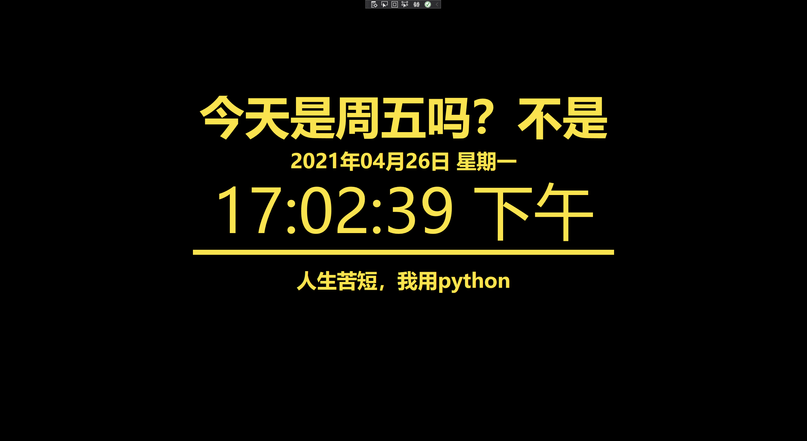

# lunarcalendar

A screen saver application despaired from [jikeCalendar in macOS](https://github.com/Dawninest/jikeCalendar-macOS).

Supported by .Net 5.0

Screen capture:

todo:

- [ ] customized slogan;
- [ ] display lunar calendar from third-party api;
- [ ] customized info displayed through local json file;
- [ ] multi-plateform support;
- [ ] globalization support;